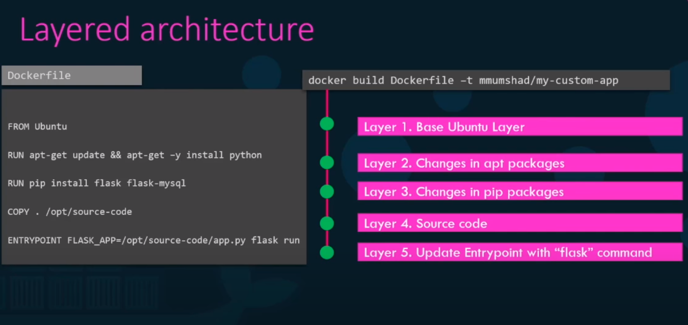
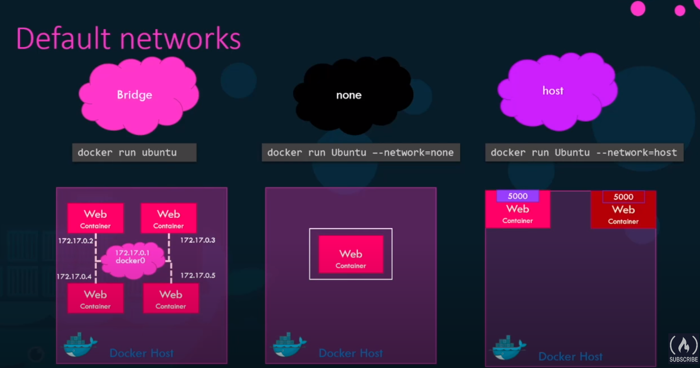

# Outline
* What are containers? What is Docker? 
* Why do you need it? What can it do? 

<br/>

* How to run Docker containers?
* Create Docker images
* Networking in Docker
* Docker Compose

<br/>

* What is Docker registry?
* How to Deploy you own private registry

<br/>

* Docker concepts in depth
* How Docker really works under the hoods

<br/>

* Docker for Windows/Mac

<br/>

* Container orchestration
* Docker Swarm
* Docker vs. Kubernetes

<br/>

# Why do you need Docker? 

* Version hell
* Dependency hell
* Platform hell

<br/>

* The compatibility matrix: **Matrix from Hell**

<br />

* Setting up different dev environments
* Different Dev/Test/Prod environments

<br/>

* Docker (container technology) solves these problems by providing something like light-weight virtual machines. 


# What are containers?

* Completely isolated environments all sharing the same OS Kernel
* Each container has its own isolated Processes, Network interfaces, Mounts, ...
* Just like virtual machines, but they all share the same OS Kernel. 

<br/>

* Containers are not a new concept. They existed now for about 10 years. Tools like Docker offer an easy to use over complex container technology. 
* Docker use LXC (Linux Containers)


<br/>

* OS actually consists of an OS kernel, an a set of software on top of it:
  * OS kernel is responsible for communicating with underlying HW. 
  * The software uses OS kernel
  * Docker uses the OS Kernel, and isolates the software on top of that. 

## Differences between VMs and Containers
* VM: HW - Hypervisor - OS (including kernel and software on top of it)
  * Heavy and GB in size.
  * Takes long to boot
  * Complete isolation from each other
  * Different OSs on the same Hypervisor and HW

<br/>

* Container: HW - OS (kernel) - Docker - Software 
  * Lightweight, MB in size
  * Boots up very fast
  * Less isolation, as more resources are shared (e.g. kernel) between containers.
  * The containers contain the software for the same OS (e.g. Linux)

# Containers vs. Images
* An images is a package or template used for creating one or more containers

* A Container is a running instance of an image
  * It is isolated
  * Has its own environment and setup processes
  * You can create many container instances from the same image

* A lot of products are already containerized and are available on Docker Hub
* You can also crate your own images and upload them to the Docker Hub

## Docker in DevOps
* Prior to Docker, the developers developed the application and then handed it to the operations, who were responsible for configuring and deploying the application. The operations often struggled with deployment, because the configuration were not the same as the developers machine.
* With Docker the developers can already create a **Dockerfile** that describes the configuration of the software and all it needs (environments, libraries, resources, ...). 
* This Docker file is used to crete an image that is then used to create containers everywhere that are exactly identical to the development configurations. 

# Docker: Getting Started
* Docker has two editions: Community Edition, and Enterprise Edition

<br/>

* Remove previous version
  
```
$ sudo apt-get remove docker docker-engine docker.io containerd runc

```

* Install Docker: 

```bash
## Update apt package index and installed required packages for apt over HTTPS:

$ sudo apt-get update

$ sudo apt-get install \
    apt-transport-https \
    ca-certificates \
    curl \
    gnupg-agent \
    software-properties-common

## Add Docker's official GPG key and verify its finger print 9DC8 5822 9FC7 DD38 854A  E2D8 8D81 803C 0EBF CD88:

$ curl -fsSL https://download.docker.com/linux/ubuntu/gpg | sudo apt-key add -

$ sudo apt-key fingerprint 0EBFCD88

pub   rsa4096 2017-02-22 [SCEA]
      9DC8 5822 9FC7 DD38 854A  E2D8 8D81 803C 0EBF CD88
uid           [ unknown] Docker Release (CE deb) <docker@docker.com>
sub   rsa4096 2017-02-22 [S]

## Add Docker repository:

$ sudo add-apt-repository \
   "deb [arch=amd64] https://download.docker.com/linux/ubuntu \
   $(lsb_release -cs) \
   stable"


## Install Docker Engine:

 $ sudo apt-get update
 $ sudo apt-get install docker-ce docker-ce-cli containerd.io

## Verify installation:

$ sudo docker version


$ sudo docker run hello-world

```

## A simple example: 

```bash
$ sudo docker run docker/whalesay cowsay Hello-World!

 ______________ 
< Hello-World! >
 -------------- 
    \
     \
      \     
                    ##        .            
              ## ## ##       ==            
           ## ## ## ##      ===            
       /""""""""""""""""___/ ===        
  ~~~ {~~ ~~~~ ~~~ ~~~~ ~~ ~ /  ===- ~~~   
       \______ o          __/            
        \    \        __/             
          \____\______/   

$ 
```

* By running this command, the Docker **pulls the images of the whalesay** from **Docker Hub** and runs it. 

# Some Docker Commands

* `docker run`

Is used to run a container from an image. 

For example running the `docker run nginx` command will run an instance of the `enginx` application from the image the **docker host** (the computer running the docker daemon), if it already exists. If the image does not exist on the docker host, it will first go out to the Docker Hub and pull the image down. This is only done for the first time. For the subsequent executions, the same image will be reused. 

* `docker ps`

List all the running containers, with some information about them, such as container id, the name of the image used to run the container, the current status, and the name of the container. 
Each container automatically gets a random id and name assigned to it by Docker. 

* `docker ps -a`
  
To see all containers running, as well as previously stopped or exited containers. 

* `docker stop <container_name>` or `docker stop <container_id>`

Stop a running container

* `docker rm <container_name>`

Remove a stopped or exited container. Returns the name of the container on success

* `docker images`

List of images on the host and their sizes. 

* `docker rmi <image_name>`

Remove the image from host. IMPORTANT: make sure that no container is running off that image. You must stop and delete all dependent images. 

* `docker pull <image_name>`

Pulls the image down from Docker Hub, so that you don't have to wait for it, when calling `docker run` for the first time. 

## Running command in Container

* Let's for example run the following command to run an Ubuntu image: 

```
$ docker run ubuntu 
```

* This command runs an instance the ubuntu image and **immediately exits**
* If we list the running containers (`$ docker ps`) we wouldn't see a running container
* If we list all containers (`$ docker ps -a`) we see that the container we jus ran, is in an **exited state**:

```
zardosht@zardosht-HP-Omen So Okt 18 20:42 
~$ docker run ubuntu
zardosht@zardosht-HP-Omen So Okt 18 20:42 
~$ docker ps -a
CONTAINER ID        IMAGE               COMMAND                 CREATED             STATUS                      PORTS               NAMES
302c2144b335        ubuntu              "/bin/bash"             3 seconds ago       Exited (0) 3 seconds ago                        fervent_galileo
241c64acd66b        ubuntu              "/bin/bash"             34 seconds ago      Exited (0) 34 seconds ago                       quizzical_varahamihira
46234699357c        docker/whalesay     "cowsay Hello-World!"   5 days ago          Exited (0) 5 days ago                           goofy_turing
zardosht@zardosht-HP-Omen So Okt 18 20:42 
~$ 
```

* Unlike virtual machines, **containers are not meant to host an entire operating system**, but rather **containers are meant to run a specific task or process**, e.g. to host an instance of a web server or application server or a database, or simply to carry out some kind of computation. Once the tasks complete, the container exits. **The container only lives as long as the process inside it, is alive!**. If the process inside the container stops, or crashes, the the container exits.

* This is why when we run an image of the Ubuntu OS, it exits immediately. Ubuntu is only an image of an operating system that is used as base image for other applications. There is no process or application running in it by default. 

* If the image isn't running any processes, or services, as the case with Ubuntu image, we can tell the docker to run a process. For example `$ docker run ubuntu sleep 5`, that sleeps for 5 seconds. When the container starts, it runs the `sleep` command (process) and sleeps for 5 seconds. When the process exits, the container exits as well. 

* To **Execute a command on a running container**, we can use the `$ docker exec` command. For example: 

```
zardosht@zardosht-HP-Omen So Okt 18 20:59 
~$ docker run --detach ubuntu sleep 180
52ffe13f1b846a5b4825f164ae4d9fa1adeeb6c50dad42c8f3dd4bfc7d634a9b

zardosht@zardosht-HP-Omen So Okt 18 20:59 
~$ docker ps 
CONTAINER ID        IMAGE               COMMAND             CREATED             STATUS              PORTS               NAMES
52ffe13f1b84        ubuntu              "sleep 180"         3 seconds ago       Up 3 seconds                            agitated_mestorf

zardosht@zardosht-HP-Omen So Okt 18 20:59 
~$ docker exec agitated_mestorf cat /etc/hosts
127.0.0.1	localhost
::1	localhost ip6-localhost ip6-loopback
fe00::0	ip6-localnet
ff00::0	ip6-mcastprefix
ff02::1	ip6-allnodes
ff02::2	ip6-allrouters
172.17.0.2	52ffe13f1b84

zardosht@zardosht-HP-Omen So Okt 18 21:00 
~$ 
```

### **Attached Mode** vs. **Detached Mode**: 
* When we run a docker command such as `$ docker run kodekloud\simple-webapp`, it runs in the foreground or in **attached mode**, meaning you are attached to the console or the **std out of the container** and you will see the output of the web service on the screen. But you won't be able to enter any command or do anything else other than viewing the output until the container stops. 

* **Detached mode** runs the docker container in the background mode and returns back to the current console's prompt. The ID of the container is printed on the console. The container will continue to run in the background. 

* **`$ docker attach <container name or id>`** will attach to a running container. 


# `docker run` Commands

## Tags

* **Tag**, for example `$ docker run redis:4.0`. 
* If you don't specify the tag, **docker runs by default the latest tag**

* How to find the information about versions/tags? checkout the docker hub. 

## Inputs (STDIN)
* `$ docker -i run kodekloud/simple-prompt-docker` 
  
  will run in **interactive mode**, accepting input from stdin. It maps the stdin of your host to the stdin of the container. But it does not have a prompt, because we are not running a terminal. 
  
* `$ docker -it run kodekloud/simple-prompt-docker`

Runs a pseudo terminal in interactive mode on the container. 

```
zardosht@zardosht-HP-Omen So Okt 18 21:41 
~$ docker run kodekloud/simple-prompt-docker
Welcome! Please enter your name: 
Hello and Welcome !

zardosht@zardosht-HP-Omen So Okt 18 21:41 
~$ docker run -i kodekloud/simple-prompt-docker
Welcome! Please enter your name: Zari

Hello and Welcome Zari!

zardosht@zardosht-HP-Omen So Okt 18 21:41 
~$ docker run -it kodekloud/simple-prompt-docker
Welcome! Please enter your name: Zari 

Hello and Welcome Zari!

```

## Port Mapping

* Each container gets an IP address on the docker host. This IP address is internal to the host and container though and cannot be accessed from outside world. 
* We can map ports of the docker host to ports of the container. For example 

```bash
# Maps port 8080 of the docker host to port 5000 of the container.  
$ docker run -p 8080:5000 kodekloud/webapp
```

* You can run multiple instances of the same container and map them to different ports on the docker host.  

```
$ docker run -p 8080:5000 kodekloud/webapp
$ docker run -p 8081:5000 kodekloud/webapp
```

* Or run instances of different applications on different ports

```
$ docker run -p 3306:3306 mysql
$ docker run -p 8306:3306 mysql
```

## Volume Mapping

* **Data is not persisted inside container**. As soon as you delete a container, all data within it is gone!
* In order to persist the data from a container, you **map a directory outside container to a directory inside container:**

```bash
# Maps the directory /opt/datadir on the docker host to the directory /var/lib/mysql inside the container. 

$ docker run -v /opt/datadir:/var/lib/mysql mysql

# As soon as the container is run, it mounts the external directory. This will all the data will be stored in the external volume (directory). 
```

## Inspecting Container: 

* `$ docker inspect <container name or id>`

Shows a JSON file containing all the details about the container, such as state, mounts, configuration data, networking.

* `$ docker logs <container name or id>`

Shows the logs of the container written to its stdout. 


## Environment Variables

* `$ docker run -e APP_COLOR=blue kodekloud/simple-webapp-color`

Sets the value for an environment variable (`APP_COLOR`) inside container. 

* to check the value of an environment variable set in a running container use the `$ docker inspect` command and check the section `Env` under `config` section. 


# Creating Images

* Why do we want to create our own images? 
  * Maybe it contains a component or service that we cannot find on the docker hub already.
  * Or we have decided that our application will be **dockerized** for ease of shipping and deployment. 

* Let's containerize a simple web application developed using Flask. 
* If we wanted to do it manually we do as follows:
    1. We start with an OS like Ubuntu
    2. Then updated the apt repositories
    3. Then install dependencies using apt
    4. Then install Python dependencies using pip
    5. Then copy the source code of the application to a location like `/opt` folder
    6. Then run the webserver using `flask` command.

* Now we create a **Dokerfile** for these instructions for setting up our application: 


```
# Dockerfile 

FROM Ubuntu

RUN apt-get update
RUN apt-get install python 

RUN pip install flask
RUN pip install flask-mysql

COPY . /opt/source-code

ENTRYPOINT FLASK_APP=/opt/source-code/app.py flask run

```

* Then we **build our image** using `docker build` command providing the Docker file as input as well as a tag name for the image: 

```
$ docker build Dockerfile --tag mmumshad/my-custom-app
```

* This creates an image locally on our system

* To push the image to Docker hub and make it available publicly we run the `docker push` command: 

```
$ docker push mmumshad/my-custom-app
```

The name of the image is the **account name** followed by the image name `my-custom-app`. 


## Dockerfile

* Has an INSTRUCTION fbased imageollowed by ARGUMENT format, e.g. FROM, RUN, COPY, and ENTRYPOINT are all instructions.
* Each instruction instructs docker to perform an action when creating the image with the given argument. 

* The first line `FROM Ubuntu` defines what the **base OS** should be for this image. Every Docker image must be based off on another image (the **base image**). Either an OS image, or another image that was created before based on an OS image. **All Dockerfiles must start with a FROM instruction**

* The `RUN` instruction instructs Docker to run a particular command on those based images. 
* The `COPY` instruction copies files from the local system onto the image. 
* The `ENTRYPOINT` allows us to run a command that will run when the images is run as a container.

## Layered Architecture of Building Images

* Docker builds images in a layered architecture. Each line of instruction crates a bew layer onto the docker image with just the changes from the previous layer. 

* In our example the first layer is the based Ubuntu OS, the second layer is Ubuntu plus apt packages, third layer is previous one plus pip packages, fourth layer is the previous one plus source code, and the final layer stores the entry point of the image. 



* The output of `docker build` shows the output of each step of the building the image

* Since each layer only stores the changes from the previous layer, it is reflected in the size as well: The base Ubuntu layer is 120 MB, layer 2 (the apt packages) is 306, layer 3 (pip packages) is 6.3 MB, layer 4 (source code) is only 229 bytes, and the layer 5 is 0 bytes. 

* `docker history <image name>` shows the layers. 

* All the layers are cached, so if the process fails at any layer, or we changed an instruction in the Dockerfile, Docker does not have to start from beginning. This is for example helpful as we update the source code of the application and rebuild the image. Only the layers above a changed layer need to be rebuilt. 

### What can be containerized? 

* Everything. 
* Actually, it can be that nobody needs to install anything anymore. They can simply run the container, and when they don't need the app anymore, they can simply remove the container without the need to cleanup too much. 

## `CMD` vs. `ENTRYPOINT`

* In this lecture we will look at COMMANDS, ENTRYPOINTS, and arguments in Docker. 

* `CMD` instruction defines the process/command that is run as soon as the container is started. 

* Let's have a look at the Dockerfile of plain Ubuntu image: 
  * It has a *default command:* `CMD ["bash"]`. 
  * But `bash` isn't really a process like a webserver or database server. It is a shell that listens for input form terminal, and if does not find the terminal, it exits. 
  * So when we start a plain Ubuntu image, it runs the `bash`. But by default, Docker does not attach a terminal to the container, so `bash` does not find a terminal and exits and the container exits too. 

* So how do we specify what should be run, when the container is started? 
  * Append the command to the `docker run`, such as `$ docker run ubuntu sleep 100`
  
* We can also specify the starting command using the `CMD` instruction
  
* `CMD` instruction can have two formats: 
  * Normal, like `CMD command param...`, like `CMD sleep 5`
  * or JSON array, like `CMD ["command", "param1", ...]`, like `CMD ["sleep", "5"]`

* Now, the argument for the `CMD` is hardcoded here. If we wanted to pass the argument form the `docker run` command, we could use the `ENTRYPOINT` instruction.

* The `ENTRYPOINT` instruction gives the name of the command that is run as soon as the container is started. Whatever argument given to the `docker run` command, is appended to the entry point command. Like:
  * `ENTRYPOINT ["sleep"]`
  * and run the container as `$ docker run ubuntu-sleeper 10`, which gives the 10 as argument to `sleep` command as the container starts.

* Now, if you also want to have a default value for the argument, then you can use both `CMD` (with default arg) and the `ENTRYPOINT` for arg given over by `docker run`. In that case the **command instruction will be appended to the entrypoint instruction**, e.g: 
  
```
FROM Ubuntu

ENTRYPOINT ["sleep"]

CMD ["5"]
```

* Now if we pass an argument over using the `docker run`, that argument is taken, otherwise `5` is appended to the entry point `sleep` command. 

* For this to work, you have to specify **both** `ENTRYPOINT` and `CMD` in **JSON format**. 


* It is also possible to use the `--entrypoint` option for the `docker run` to change the entry point: 

```
$ docker run --entrypoint sleep2.0 ubuntu-sleeper 10
```

# Docker Networking

* When docker is installed, it creates automatically three networks: 
  * **Bridge**: Default network a container is attached to. Separate network of containers from host. Needs mapping on the host ports to container port. 
  * **None**: The containers are not attached to any network and does not have access to each other or to the host's network. They run in isolation. 
  * **Host**: Host's network becomes container's network. 

* You can specify the network for the container using `--network` command line parameter:
  * `docker run Ubuntu --network=none`
  * `docker run Ubuntu --network=host`




### Bridge Network

* Bridge network is a private internal network created by Docker on the host. 
* All containers attach to this network by default and get an internal IP Address usually in the range of `172.17.x.x`. 
* The containers can access each other using this internal IP. 
* To access any of these containers to the outside world, we need to map their ports to host's ports. 

### Host Network
* Takes out any network isolation between the host and the container. 
* This means for example port `5000` and an example web app in a container is automatically accessible by the outside world on the port `5000` of the host without the need for any port mapping. 
* This means however that now we are no more able to run multiple containers that all would use the same port (e.g. 5000), as the host ports are now common to all the containers with the "host notwork"
  
## User-defined Networks
* By default docker creates only one internal bridge network. 
* But what if we want to separate containers into different internal bridge networks? 
  * e.g. two containers in a network with the IP range 172.17.0.2 and 172.17.0.4
  * and two containers with the IP range 182.18.0.3 and 182.18.0.2

* We can create our own internal network using `docker network` command:
  * `docker network create --driver bridge --subnet 182.18.0.0/16 <custom-network-name>`
  * You need to provide the driver, which is `bridge`, the subnet, and the custom isolated network name. 
  * `docker network ls`       lists all the custom networks. 

* How do we inspect network settings and IP address assigned to a container? 
  * `docker inspect <container-name>`
  * the out put contains a network section that shows the type of the network (e.g bridge), container's IP address, container's MAC address, gateway, and other settings.

## Embedded DNS

* Containers can reach each other using their names. 
* For example if a web server is running in a container with the name `web` with the IP address 172.17.0.2 and a Mysql instance is running in a container with the name `mysql` with the IP address 172.17.0.3. 
* Then we can either use the internal ip address or use the container name. 
  * But the IP address is not a good idea, because it may change after a system reboot. 
  * the right way to do it is to use the container name. 

* All containers within a docker host, can resolve each other with the name of the container. The Docker maintains an internal DNS for resolving container names. 
* Built-in DNS server always runs at the IP address `127.0.0.11`

* How does Docker implement internal networking? what is the technology behind it? 
  * Docker uses **Network Namespaces** that creates a separate namespace for each container. 
  * It then uses **virtual ethernet pairs** to connect containers together. 

* `docker run --network=wp-mysql-network -e DB_Host=mysql-db -e DB_Password=db_pass123 -p 38080:8080 --name webapp --link mysql-db:mysql-db -d kodekloud/simple-webapp-mysql`

# Docker Storage
