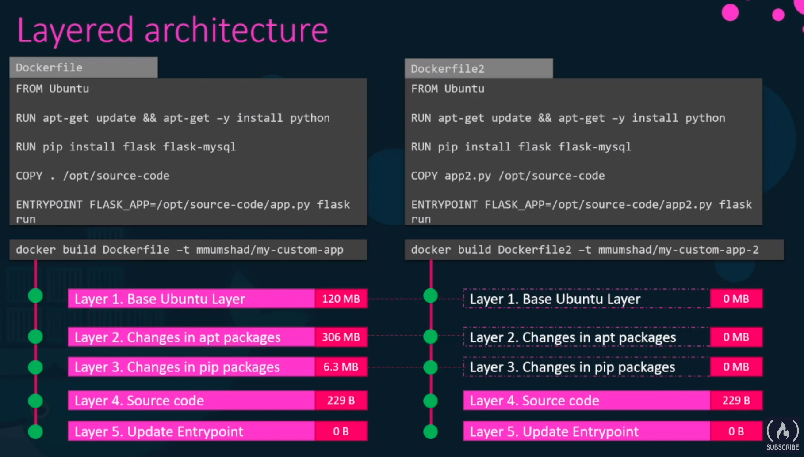
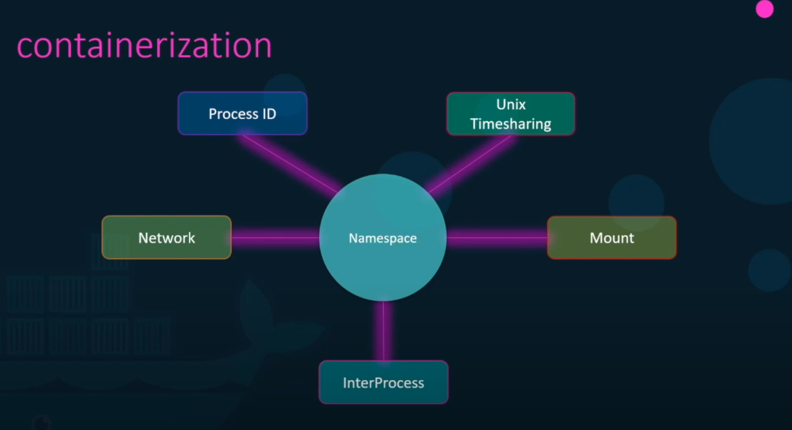
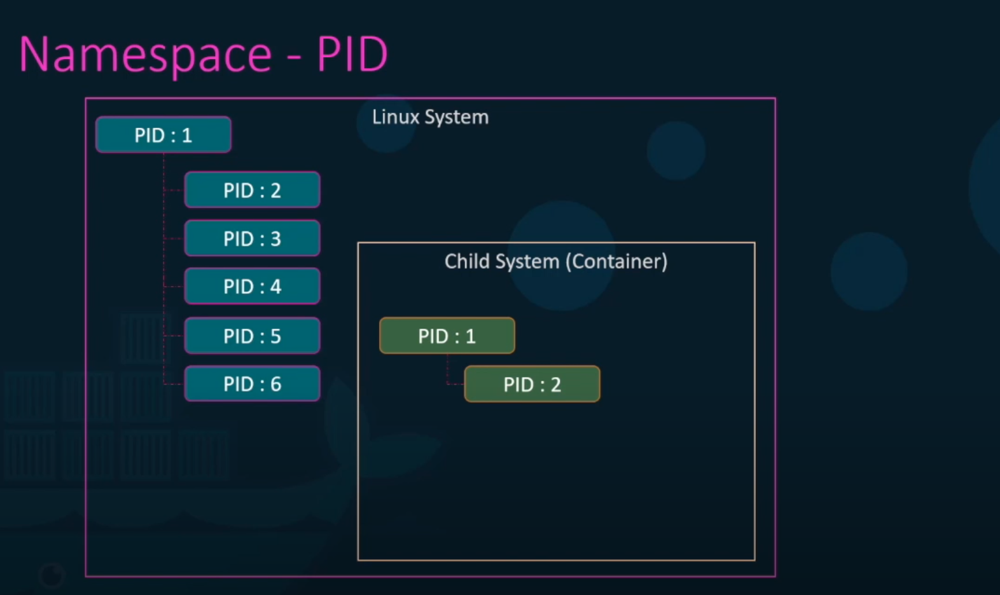

# Outline
* What are containers? What is Docker? 
* Why do you need it? What can it do? 

<br/>

* How to run Docker containers?
* Create Docker images
* Networking in Docker
* Docker Compose

<br/>

* What is Docker registry?
* How to Deploy you own private registry

<br/>

* Docker concepts in depth
* How Docker really works under the hoods

<br/>

* Docker for Windows/Mac

<br/>

* Container orchestration
* Docker Swarm
* Docker vs. Kubernetes

<br/>

# Why do you need Docker? 

* Version hell
* Dependency hell
* Platform hell

<br/>

* The compatibility matrix: **Matrix from Hell**

<br />

* Setting up different dev environments
* Different Dev/Test/Prod environments

<br/>

* Docker (container technology) solves these problems by providing something like light-weight virtual machines. 


# What are containers?

* Completely isolated environments all sharing the same OS Kernel
* Each container has its own isolated Processes, Network interfaces, Mounts, ...
* Just like virtual machines, but they all share the same OS Kernel. 

<br/>

* Containers are not a new concept. They existed now for about 10 years. Tools like Docker offer an easy to use over complex container technology. 
* Docker use LXC (Linux Containers)


<br/>

* OS actually consists of an OS kernel, an a set of software on top of it:
  * OS kernel is responsible for communicating with underlying HW. 
  * The software uses OS kernel
  * Docker uses the OS Kernel, and isolates the software on top of that. 

## Differences between VMs and Containers
* VM: HW - Hypervisor - OS (including kernel and software on top of it)
  * Heavy and GB in size.
  * Takes long to boot
  * Complete isolation from each other
  * Different OSs on the same Hypervisor and HW

<br/>

* Container: HW - OS (kernel) - Docker - Software 
  * Lightweight, MB in size
  * Boots up very fast
  * Less isolation, as more resources are shared (e.g. kernel) between containers.
  * The containers contain the software for the same OS (e.g. Linux)

# Containers vs. Images
* An images is a package or template used for creating one or more containers

* A Container is a running instance of an image
  * It is isolated
  * Has its own environment and setup processes
  * You can create many container instances from the same image

* A lot of products are already containerized and are available on Docker Hub
* You can also crate your own images and upload them to the Docker Hub

## Docker in DevOps
* Prior to Docker, the developers developed the application and then handed it to the operations, who were responsible for configuring and deploying the application. The operations often struggled with deployment, because the configuration were not the same as the developers machine.
* With Docker the developers can already create a **Dockerfile** that describes the configuration of the software and all it needs (environments, libraries, resources, ...). 
* This Docker file is used to crete an image that is then used to create containers everywhere that are exactly identical to the development configurations. 

# Docker: Getting Started
* Docker has two editions: Community Edition, and Enterprise Edition

<br/>

* Remove previous version
  
```
$ sudo apt-get remove docker docker-engine docker.io containerd runc

```

* Install Docker: 

```bash
## Update apt package index and installed required packages for apt over HTTPS:

$ sudo apt-get update

$ sudo apt-get install \
    apt-transport-https \
    ca-certificates \
    curl \
    gnupg-agent \
    software-properties-common

## Add Docker's official GPG key and verify its finger print 9DC8 5822 9FC7 DD38 854A  E2D8 8D81 803C 0EBF CD88:

$ curl -fsSL https://download.docker.com/linux/ubuntu/gpg | sudo apt-key add -

$ sudo apt-key fingerprint 0EBFCD88

pub   rsa4096 2017-02-22 [SCEA]
      9DC8 5822 9FC7 DD38 854A  E2D8 8D81 803C 0EBF CD88
uid           [ unknown] Docker Release (CE deb) <docker@docker.com>
sub   rsa4096 2017-02-22 [S]

## Add Docker repository:

$ sudo add-apt-repository \
   "deb [arch=amd64] https://download.docker.com/linux/ubuntu \
   $(lsb_release -cs) \
   stable"


## Install Docker Engine:

 $ sudo apt-get update
 $ sudo apt-get install docker-ce docker-ce-cli containerd.io

## Verify installation:

$ sudo docker version


$ sudo docker run hello-world

```

## A simple example: 

```bash
$ sudo docker run docker/whalesay cowsay Hello-World!

 ______________ 
< Hello-World! >
 -------------- 
    \
     \
      \     
                    ##        .            
              ## ## ##       ==            
           ## ## ## ##      ===            
       /""""""""""""""""___/ ===        
  ~~~ {~~ ~~~~ ~~~ ~~~~ ~~ ~ /  ===- ~~~   
       \______ o          __/            
        \    \        __/             
          \____\______/   

$ 
```

* By running this command, the Docker **pulls the images of the whalesay** from **Docker Hub** and runs it. 

# Some Docker Commands

* `docker run`

Is used to run a container from an image. 

For example running the `docker run nginx` command will run an instance of the `enginx` application from the image the **docker host** (the computer running the docker daemon), if it already exists. If the image does not exist on the docker host, it will first go out to the Docker Hub and pull the image down. This is only done for the first time. For the subsequent executions, the same image will be reused. 

* `docker ps`

List all the running containers, with some information about them, such as container id, the name of the image used to run the container, the current status, and the name of the container. 
Each container automatically gets a random id and name assigned to it by Docker. 

* `docker ps -a`
  
To see all containers running, as well as previously stopped or exited containers. 

* `docker stop <container_name>` or `docker stop <container_id>`

Stop a running container

* `docker rm <container_name>`

Remove a stopped or exited container. Returns the name of the container on success

* `docker images`

List of images on the host and their sizes. 

* `docker rmi <image_name>`

Remove the image from host. IMPORTANT: make sure that no container is running off that image. You must stop and delete all dependent images. 

* `docker pull <image_name>`

Pulls the image down from Docker Hub, so that you don't have to wait for it, when calling `docker run` for the first time. 

## Running command in Container

* Let's for example run the following command to run an Ubuntu image: 

```
$ docker run ubuntu 
```

* This command runs an instance the ubuntu image and **immediately exits**
* If we list the running containers (`$ docker ps`) we wouldn't see a running container
* If we list all containers (`$ docker ps -a`) we see that the container we jus ran, is in an **exited state**:

```
zardosht@zardosht-HP-Omen So Okt 18 20:42 
~$ docker run ubuntu
zardosht@zardosht-HP-Omen So Okt 18 20:42 
~$ docker ps -a
CONTAINER ID        IMAGE               COMMAND                 CREATED             STATUS                      PORTS               NAMES
302c2144b335        ubuntu              "/bin/bash"             3 seconds ago       Exited (0) 3 seconds ago                        fervent_galileo
241c64acd66b        ubuntu              "/bin/bash"             34 seconds ago      Exited (0) 34 seconds ago                       quizzical_varahamihira
46234699357c        docker/whalesay     "cowsay Hello-World!"   5 days ago          Exited (0) 5 days ago                           goofy_turing
zardosht@zardosht-HP-Omen So Okt 18 20:42 
~$ 
```

* Unlike virtual machines, **containers are not meant to host an entire operating system**, but rather **containers are meant to run a specific task or process**, e.g. to host an instance of a web server or application server or a database, or simply to carry out some kind of computation. Once the tasks complete, the container exits. **The container only lives as long as the process inside it, is alive!**. If the process inside the container stops, or crashes, the the container exits.

* This is why when we run an image of the Ubuntu OS, it exits immediately. Ubuntu is only an image of an operating system that is used as base image for other applications. There is no process or application running in it by default. 

* If the image isn't running any processes, or services, as the case with Ubuntu image, we can tell the docker to run a process. For example `$ docker run ubuntu sleep 5`, that sleeps for 5 seconds. When the container starts, it runs the `sleep` command (process) and sleeps for 5 seconds. When the process exits, the container exits as well. 

* To **Execute a command on a running container**, we can use the `$ docker exec` command. For example: 

```
zardosht@zardosht-HP-Omen So Okt 18 20:59 
~$ docker run --detach ubuntu sleep 180
52ffe13f1b846a5b4825f164ae4d9fa1adeeb6c50dad42c8f3dd4bfc7d634a9b

zardosht@zardosht-HP-Omen So Okt 18 20:59 
~$ docker ps 
CONTAINER ID        IMAGE               COMMAND             CREATED             STATUS              PORTS               NAMES
52ffe13f1b84        ubuntu              "sleep 180"         3 seconds ago       Up 3 seconds                            agitated_mestorf

zardosht@zardosht-HP-Omen So Okt 18 20:59 
~$ docker exec agitated_mestorf cat /etc/hosts
127.0.0.1	localhost
::1	localhost ip6-localhost ip6-loopback
fe00::0	ip6-localnet
ff00::0	ip6-mcastprefix
ff02::1	ip6-allnodes
ff02::2	ip6-allrouters
172.17.0.2	52ffe13f1b84

zardosht@zardosht-HP-Omen So Okt 18 21:00 
~$ 
```

### **Attached Mode** vs. **Detached Mode**: 
* When we run a docker command such as `$ docker run kodekloud\simple-webapp`, it runs in the foreground or in **attached mode**, meaning you are attached to the console or the **std out of the container** and you will see the output of the web service on the screen. But you won't be able to enter any command or do anything else other than viewing the output until the container stops. 

* **Detached mode** runs the docker container in the background mode and returns back to the current console's prompt. The ID of the container is printed on the console. The container will continue to run in the background. 

* **`$ docker attach <container name or id>`** will attach to a running container. 


# `docker run` Commands

## Tags

* **Tag**, for example `$ docker run redis:4.0`. 
* If you don't specify the tag, **docker runs by default the latest tag**

* How to find the information about versions/tags? checkout the docker hub. 

## Inputs (STDIN)
* `$ docker -i run kodekloud/simple-prompt-docker` 
  
  will run in **interactive mode**, accepting input from stdin. It maps the stdin of your host to the stdin of the container. But it does not have a prompt, because we are not running a terminal. 
  
* `$ docker -it run kodekloud/simple-prompt-docker`

Runs a pseudo terminal in interactive mode on the container. 

```
zardosht@zardosht-HP-Omen So Okt 18 21:41 
~$ docker run kodekloud/simple-prompt-docker
Welcome! Please enter your name: 
Hello and Welcome !

zardosht@zardosht-HP-Omen So Okt 18 21:41 
~$ docker run -i kodekloud/simple-prompt-docker
Welcome! Please enter your name: Zari

Hello and Welcome Zari!

zardosht@zardosht-HP-Omen So Okt 18 21:41 
~$ docker run -it kodekloud/simple-prompt-docker
Welcome! Please enter your name: Zari 

Hello and Welcome Zari!

```

## Port Mapping

* Each container gets an IP address on the docker host. This IP address is internal to the host and container though and cannot be accessed from outside world. 
* We can map ports of the docker host to ports of the container. For example 

```bash
# Maps port 8080 of the docker host to port 5000 of the container.  
$ docker run -p 8080:5000 kodekloud/webapp
```

* You can run multiple instances of the same container and map them to different ports on the docker host.  

```
$ docker run -p 8080:5000 kodekloud/webapp
$ docker run -p 8081:5000 kodekloud/webapp
```

* Or run instances of different applications on different ports

```
$ docker run -p 3306:3306 mysql
$ docker run -p 8306:3306 mysql
```

## Volume Mapping

* **Data is not persisted inside container**. As soon as you delete a container, all data within it is gone!
* In order to persist the data from a container, you **map a directory outside container to a directory inside container:**

```bash
# Maps the directory /opt/datadir on the docker host to the directory /var/lib/mysql inside the container. 

$ docker run -v /opt/datadir:/var/lib/mysql mysql

# As soon as the container is run, it mounts the external directory. This will all the data will be stored in the external volume (directory). 
```

## Inspecting Container: 

* `$ docker inspect <container name or id>`

Shows a JSON file containing all the details about the container, such as state, mounts, configuration data, networking.

* `$ docker logs <container name or id>`

Shows the logs of the container written to its stdout. 


## Environment Variables

* `$ docker run -e APP_COLOR=blue kodekloud/simple-webapp-color`

Sets the value for an environment variable (`APP_COLOR`) inside container. 

* to check the value of an environment variable set in a running container use the `$ docker inspect` command and check the section `Env` under `config` section. 


# Creating Images

* Why do we want to create our own images? 
  * Maybe it contains a component or service that we cannot find on the docker hub already.
  * Or we have decided that our application will be **dockerized** for ease of shipping and deployment. 

* Let's containerize a simple web application developed using Flask. 
* If we wanted to do it manually we do as follows:
    1. We start with an OS like Ubuntu
    2. Then updated the apt repositories
    3. Then install dependencies using apt
    4. Then install Python dependencies using pip
    5. Then copy the source code of the application to a location like `/opt` folder
    6. Then run the webserver using `flask` command.

* Now we create a **Dockerfile** for these instructions for setting up our application: 


```
# Dockerfile 

FROM Ubuntu

RUN apt-get update
RUN apt-get install python 

RUN pip install flask
RUN pip install flask-mysql

COPY . /opt/source-code

ENTRYPOINT FLASK_APP=/opt/source-code/app.py flask run

```

* Then we **build our image** using `docker build` command providing the Docker file as input as well as a tag name for the image: 

```
$ docker build Dockerfile --tag mmumshad/my-custom-app
```

* This creates an image locally on our system

* To push the image to Docker hub and make it available publicly we run the `docker push` command: 

```
$ docker push mmumshad/my-custom-app
```

The name of the image is the **account name** followed by the image name `my-custom-app`. 


## Dockerfile

* Has an INSTRUCTION followed by ARGUMENT format, e.g. FROM, RUN, COPY, and ENTRYPOINT are all instructions.
* Each instruction instructs docker to perform an action when creating the image with the given argument. 

* The first line `FROM Ubuntu` defines what the **base OS** should be for this image. Every Docker image must be based off on another image (the **base image**). Either an OS image, or another image that was created before based on an OS image. **All Dockerfiles must start with a FROM instruction**

* The `RUN` instruction instructs Docker to run a particular command on those based images. 
* The `COPY` instruction copies files from the local system onto the image. 
* The `ENTRYPOINT` allows us to run a command that will run when the images is run as a container.

## Layered Architecture of Building Images

* Docker builds images in a layered architecture. Each line of instruction crates a bew layer onto the docker image with just the changes from the previous layer. 

* In our example the first layer is the based Ubuntu OS, the second layer is Ubuntu plus apt packages, third layer is previous one plus pip packages, fourth layer is the previous one plus source code, and the final layer stores the entry point of the image. 


* The output of `docker build` shows the output of each step of the building the image

* Since each layer only stores the changes from the previous layer, it is reflected in the size as well: The base Ubuntu layer is 120 MB, layer 2 (the apt packages) is 306, layer 3 (pip packages) is 6.3 MB, layer 4 (source code) is only 229 bytes, and the layer 5 is 0 bytes. 

* `docker history <image name>` shows the layers. 

* All the layers are cached, so if the process fails at any layer, or we changed an instruction in the Dockerfile, Docker does not have to start from beginning. This is for example helpful as we update the source code of the application and rebuild the image. Only the layers above a changed layer need to be rebuilt. 

### What can be containerized? 

* Everything. 
* Actually, it can be that nobody needs to install anything anymore. They can simply run the container, and when they don't need the app anymore, they can simply remove the container without the need to cleanup too much. 

## `CMD` vs. `ENTRYPOINT`

* In this lecture we will look at COMMANDS, ENTRYPOINTS, and arguments in Docker. 

* `CMD` instruction defines the process/command that is run as soon as the container is started. 

* Let's have a look at the Dockerfile of plain Ubuntu image: 
  * It has a *default command:* `CMD ["bash"]`. 
  * But `bash` isn't really a process like a webserver or database server. It is a shell that listens for input form terminal, and if does not find the terminal, it exits. 
  * So when we start a plain Ubuntu image, it runs the `bash`. But by default, Docker does not attach a terminal to the container, so `bash` does not find a terminal and exits and the container exits too. 

* So how do we specify what should be run, when the container is started? 
  * Append the command to the `docker run`, such as `$ docker run ubuntu sleep 100`
  
* We can also specify the starting command using the `CMD` instruction
  
* `CMD` instruction can have two formats: 
  * Normal, like `CMD command param...`, like `CMD sleep 5`
  * or JSON array, like `CMD ["command", "param1", ...]`, like `CMD ["sleep", "5"]`

* Now, the argument for the `CMD` is hardcoded here. If we wanted to pass the argument form the `docker run` command, we could use the `ENTRYPOINT` instruction.

* The `ENTRYPOINT` instruction gives the name of the command that is run as soon as the container is started. Whatever argument given to the `docker run` command, is appended to the entry point command. Like:
  * `ENTRYPOINT ["sleep"]`
  * and run the container as `$ docker run ubuntu-sleeper 10`, which gives the 10 as argument to `sleep` command as the container starts.

* Now, if you also want to have a default value for the argument, then you can use both `CMD` (with default arg) and the `ENTRYPOINT` for arg given over by `docker run`. In that case the **command instruction will be appended to the entrypoint instruction**, e.g: 
  
```
FROM Ubuntu

ENTRYPOINT ["sleep"]

CMD ["5"]
```

* Now if we pass an argument over using the `docker run`, that argument is taken, otherwise `5` is appended to the entry point `sleep` command. 

* For this to work, you have to specify **both** `ENTRYPOINT` and `CMD` in **JSON format**. 


* It is also possible to use the `--entrypoint` option for the `docker run` to change the entry point: 

```
$ docker run --entrypoint sleep2.0 ubuntu-sleeper 10
```

# Docker Networking

* When docker is installed, it creates automatically three networks: 
  * **Bridge**: Default network a container is attached to. Separate network of containers from host. Needs mapping on the host ports to container port. 
  * **None**: The containers are not attached to any network and does not have access to each other or to the host's network. They run in isolation. 
  * **Host**: Host's network becomes container's network. 

* You can specify the network for the container using `--network` command line parameter:
  * `docker run Ubuntu --network=none`
  * `docker run Ubuntu --network=host`


### Bridge Network

* Bridge network is a private internal network created by Docker on the host. 
* All containers attach to this network by default and get an internal IP Address usually in the range of `172.17.x.x`. 
* The containers can access each other using this internal IP. 
* To access any of these containers to the outside world, we need to map their ports to host's ports. 

### Host Network
* Takes out any network isolation between the host and the container. 
* This means for example port `5000` and an example web app in a container is automatically accessible by the outside world on the port `5000` of the host without the need for any port mapping. 
* This means however that now we are no more able to run multiple containers that all would use the same port (e.g. 5000), as the host ports are now common to all the containers with the "host notwork"
  
## User-defined Networks
* By default docker creates only one internal bridge network. 
* But what if we want to separate containers into different internal bridge networks? 
  * e.g. two containers in a network with the IP range 172.17.0.2 and 172.17.0.4
  * and two containers with the IP range 182.18.0.3 and 182.18.0.2

* We can create our own internal network using `docker network` command:
  * `docker network create --driver bridge --subnet 182.18.0.0/16 <custom-network-name>`
  * You need to provide the driver, which is `bridge`, the subnet, and the custom isolated network name. 
  * `docker network ls`       lists all the custom networks. 

* How do we inspect network settings and IP address assigned to a container? 
  * `docker inspect <container-name>`
  * the out put contains a network section that shows the type of the network (e.g bridge), container's IP address, container's MAC address, gateway, and other settings.

## Embedded DNS

* Containers can reach each other using their names. 
* For example if a web server is running in a container with the name `web` with the IP address 172.17.0.2 and a Mysql instance is running in a container with the name `mysql` with the IP address 172.17.0.3. 
* Then we can either use the internal ip address or use the container name. 
  * But the IP address is not a good idea, because it may change after a system reboot. 
  * the right way to do it is to use the container name. 

* All containers within a docker host, can resolve each other with the name of the container. The Docker maintains an internal DNS for resolving container names. 
* Built-in DNS server always runs at the IP address `127.0.0.11`

* How does Docker implement internal networking? what is the technology behind it? 
  * Docker uses **Network Namespaces** that creates a separate namespace for each container. 
  * It then uses **virtual ethernet pairs** to connect containers together. 

* `docker run --network=wp-mysql-network -e DB_Host=mysql-db -e DB_Password=db_pass123 -p 38080:8080 --name webapp --link mysql-db:mysql-db -d kodekloud/simple-webapp-mysql`


# Docker Storage
* Docker storage drivers and file systems
  * Where and how docker stores data?
  * How it manages file systems of the containers? 

## How Docker stores data on the local file system

* When Docker is installed on a systems, it creates a folder structures at:
  * `/var/lib/docker`
  * This is where Docker stores all its data by default. This data includes files related to images and containers running on the host. 
      * `containers`: All files related to containers
      * `image`: All files related to images
      * `volumes`: Volumes created by the Docker containers
      * `aufs`: 


* Where and in what format does docker store files related to images and containers? 
  * **Layered Architecture** (recap): remember that **each line of instruction in the Dockerfile created a new layer in the docker image with just the changes from previous layer**
  * Each layer only adds what is needed on top of the previous layer. 
  * In this way, the layers are very efficient and can be very small in size (even zero or some bytes) 
  * Also note that **Docker does not recreate layers that are common (the same) between different containers (Dockerfile)**
  * For example, of two applications relay on Ubuntu image as teh first layer (instruction in Dockerfile), there will be only one Ubuntu layer that is shared between them. 
  * This way Docker creates its images faster and efficiently saves disk space.  
  * This is also the case whenever we update the application code: Docker reuses all the previous layers form cache and quickly rebuilds the application image by updating the latest source code and the layers above it. Thus saving a lot of time during rebuilds and updates. 



* All layers of the image on bottom-up, for example from the base image up to the entry-point, form the **docker image layer**. These image layers are read-only and cannot be changed. If we want to change them, we have to rebuild the image. 

* When we run the `docker run <image-name>` command, a *writeable* **container layer** is created on top of the image layers. This writable layer now contains all the files and data of the container, such as log files by the applications, any temporary files created by the container, or just any file created by the user on that container. 

* The life of this layer is only as long as the container is alive. When the container is destroyed, this last layer and all the changes stored in it are also destroyed. 

* Remember that the same image layers is shared by all the containers created using this image. 

* In the writable container layer, the user can create new files. The application code though (that was used to create teh image) is part of the image layer and hence is read-only and cannot be modified. This is good. 

* However it is still possible to modify application files in the writable container layer using the **copy-on-write** mechanism: Whenever we change some file that belongs to the image layer (e.g. a file in our application code), *a copy of that file* is created in the writable container layer that we can manipulate. 
* Note that whenever we delete the container, all the modified files and newly added files in the writeable container layer al also lost. 

## Volumes

* What if we want to persist the data created in the container layer? 
  * For example if we want to persist the data created by a database running inside a container? 

* For that we can add **a persistent volume** to the container: 
  * first create a volume using `docker volume cerate <volume-name>` command.
  * It creates a folder with the given `<volume-name>` (let's say its name is `data_volume`) under the `/var/lib/docker/volumes` folder.  
  * Then when we run the docker container using the `docker run` command, we can mount that volume into writeable container layer: 
  * `docker run -v data_volume:/var/lib/mysql mysql`
  * The `-v data_volume:/var/lib/mysql` mounts the `data_volume` volume into the mount point `/var/lib/mysql` in the container. 
  * This way all the data created by the (in this example) mysql are in fact stored in the `data_volume` volume (folder) on the host. 
  * Even if the container is destroyed (deleted), the data stored in the volume remains intact on the host. 

* If the volume given in the `-v <vol_name>:<mount_point>` option does not exist (i.e. is not created before hand using `docker volume cerate` command), the the docker automatically creates it. 

* To see all the volumes, you can list the content of the `/var/lib/docker/volumes` folder. 

### Volume Mounting vs. Bind Mounting

* The above procedure with the volumes created (either manually or automatically by Docker) under `/var/lib/docker/volumes` folder is called **volume mounting**

* If we don't want our data folder on the host to be under Docker volumes, we can use **bind mounting**
  * We still use the same command as before, but this time we will provide the complete path to the folder we want to mount into the container (e.g. say a `~/data/mysql` folder at our home)
  * `docker run -v ~/data/mysql:/var/lib/mysql mysql`

* **Volume Mount**: mounts a volume from the Docker's volumes directory
* **Bind Mount**: mounts a directory from any location on the docker host 

* **Note:** using the `-v` is the old way, instead use the new option `--mount` which is more verbose, as we have to specify each parameter in a key=value format. 
  * For example the previous command ca be written using the `--mount` option by giving the `type`, `source`, and the `target` parameters: 
  * `docker run --mount type=bind,source=~/data/mysql,target=/var/lib/mysql mysql`
  

### Storage Drivers: 

Who is responsible for doing all of these operations? e.g.
  * maintaining the layered architecture
  * creating a writable container layer
  * moving files across layers for copy-on-write, 
  * etc.

* **Storage Driver**: Docker uses storage drivers to enable the layered architecture. 

* Some of the common storage drivers are: 
  * AUFS
  * ZFS
  * BTRFS
  * Device Mapper
  * Overlay
  * Overlay2

* The selection of the storage deriver depends on the underlying OS. 
    * For example with Ubuntu, the default storage driver is AUFS, where as this storage driver is not available on other OSs such as Fedora or CentOS. In that case maybe the Device Mapper is a better option. 
    * Docker will choose the best storage driver automatically based on the OS. 
    * Different storage drivers also provide different performance, stability, and characteristics. So you may want to choose one that fits the needs of your application and organization. 


# Docker Compose

* YAML: 


* Recap:
  * We first run how to run docker containers using `docker run` command.


* If we needed to setup a complex application, running multiple services, a better way to do it is to use **Docker Compose**

* With docker compose, we create a new configuration file called `docker-compose.yml` and put together the different services and the options for running them. 

* Then we can simply run a `docker-compose up` command to bring up the entire application stack. 

Instead of following four commands: 

```bash


$ docker run mmumshad/simple-webapp
$ docker run mongodb
$ docker run redis:alpine
$ docker run:ansible
```

We can have the following single `docker-compose.yml` file for configuring all services required for the application

```yaml
services:
  web:
    image: "mmumshad/simple-webapp"
  database:
    image: "mongodb"
  messaging:
    image: "redis:alpine"
  orchestration: 
    image: "ansible"
```

* This is **easier to implement, run and maintain** since **as all configurations needed for the application and all changes are always stored in the docker-compose.yml configuration file** 

* However this is all applicable to running containers on one single docker host. 


## Example Application 

Let's take a look at the docker's simple yet comprehensive sample applications, developed by docker to demonstrate the various features of running an **application stack** on docker. 

* It is a voting application consisting of the following components, each communicating to the next one. 
  * voting-app: a web app developed in python to provide an interface for the users to vote. User can select between two options, a dog and a cat. 
  * in-memory DB: When user makes a selection the vote is stored in *redis*. redis in this case serves as a database in memory. 
  * worker: The vote is then processed by worker, which is an application written in .Net
  * db: The worker .Net application processes the vote, and updates our persistent database, which is a PostgresSQL database. This database simply has a table with number of votes for each category: cats and dogs. If users voted for any category, its corresponding column gets incremented. 
  * result-app: Finally, the result of the voting is displayed in the result-app, which is another web application but this time developed in node.js. It reads the result of the votes from the SQL database and displays it to the user. 

* **Note:** As we can see, this sample application (although very simple in concept) is developed as a combination of different services, different development tools, and multiple different development platforms, such as Python, .Net, and Node.js. 

* It shows how easy it is using Docker to setup an entire complex application stack consisting different components and technologies. 

* There is also **Docker Swarm** services and stacks setting up such an application on an **scalable cluster**. But let's us keep it aside for now, and see how we can put together this application stack on a **single docker host.**


### Using `docker run` command: 

* Let's first see how it would look like if we wanted to use `docker run` commends. We assume all images of the components of the application are already build and available on docker repository:

```bash
# data layer
$ docker run -d --name=redis redis
$ docker run -d --name=db postgres:9.4

# application services
$ docker run -d --name=vote -p 5000:80 voting-app
$ docker run -d --name=result -p 5001:80 result-app
$ docker run -d --name=worker worker
```

* The above commands look good, but it does not work, since we **haven't linked the components** together. 
  * We haven't told the voting application to use this particular redis instance. 
  * There could be multiple redis instances running. 
  * Similarity we haven't told the worker and the result-app to use the this particular PostgresSQL database instance that we ran. 

* For this we use **`--link`** option. The `--link <service-instance-container-name>:<name-to-be-resolved-in-service-client-container>` option allows a container to resolve another container by the name. For example 

```bash
$ docker run -d --name=redis redis
$ docker run -d --name=vote -p 5000:80 --link redis:redis voting-app
```

* Note that for that to work, we need to name the containers when we run them.  

* We can also use the simple `--link db` option, which creates a link with the same name (equivalent to `--link db:db`)

* The `--link` option works by adding an entry in the `/ect/hosts` file of the service client container, e.g. the voting-app in our case, with the `<name-to-be-resolved-in-service-client-container>` and the internal IP address of the service provider container, e.g the redis container in our case. 

* In our example, we now need to add the following `--link` options. Note that the worker application needs two `--link` options, one for the redis container and one for the PostgresSQL database: 

```bash
# data layer
$ docker run -d --name=redis redis
$ docker run -d --name=db postgres:9.4

# application services
$ docker run -d --name=vote -p 5000:80 --link redis:redis voting-app
$ docker run -d --name=result -p 5001:80 --link db:db result-app
$ docker run -d --name=worker --link db:db --link redis:redis worker
```

* Note that using `--link` option in Docker is deprecated now, in favor of advanced options in docker compose and swarm that allow achieving similar behavior in much better way. 

### Using docker-compose.yml

The equivalent `docker-compose.yml` configuration for our example above would be: 

```yml
redis: 
  image: redis

db:
  image: postgres:9.4

vote:
  image: voting-app
  ports: 
    - 5000:80
  links:
    - redis

result: 
  image: result-app
  ports: 
    - 5001:80
  links:
    - db

worker:
  image: worker
  links:
    - redis
    - db

```

* Now we only need to run a `$ docker-compose run` command to bring up the entire application stack.  


## Docker compose - build

* In our example, the images for redis and PostgresSQL already exist. They are official images available on Docker Hub. 

* But what about the other three images? `voting-app`, `result-app`, `worker`? They are images of our own application. 

* We can use the `build` option in `docker-compose.yml` to point Docker Compose to a directory where the code of the image **including a Dockerfile** resides: 

```yml
redis: 
  image: redis

db:
  image: postgres:9.4

vote:
  build: ./voting-app
  ports: 
    - 5000:80
  links:
    - redis

result: 
  build: ./result-app
  ports: 
    - 5001:80
  links:
    - db

worker:
  build: ./worker
  links:
    - redis
    - db

```

* The corresponding application directories in the above `docker-compose.yml` must contain a **`Dockerfile`** that instructs the Docker Compose how to build the image. 

* This time when we call the `docker-compose up` command, it will first build the images, give a temporary name for them, and then it uses those images to build containers using the options we specified before. 

## Docker Compose - Versions

* Docker Compose evolved over time and there are different versions of it available, that support different options.  
  * For example in Docker Compose version 1, it was not possible to define the deployment of images on networks other than bridge.  
  * Or it was not possible in the version 1 of Docker Compose to specify the order of the containers starting. 

* With Docker Compose version 2 and above, the format of the `docker-compose.yml` file also changed a little bit: 
  * We no longer specify the application stack information as we used before. It is now all specified in the **`services` section**

```yml

version: 2

services:
  redis: 
    image: redis

  db:
    image: postgres:9.4

  vote:
    build: ./voting-app
    ports: 
      - 5000:80
    depends_on:
      - redis

  result: 
    build: ./result-app
    ports: 
      - 5001:80

  worker:
    build: ./worker
    depends_on:
      - redis
      - db

```

* From version 2 and above, the version of the Docker Compose must be specified at the top of `docker-compose.yml` file. 

* Another difference between Docker Compose versions is **networking**:
  * With **version 1**, docker compose attaches all the containers it runs to the **default bridged network** and then uses **links** to enable communication between containers
  * With version 2, docker compose automatically creates a **dedicated bridge network for our application** and attaches all the containers to this network. All containers are then able to communicate with each other, using their corresponding **service names**. So, we basically don't need to use links in version 2 of docker compose. We can get rid of all the `links` section, when converting a file from docker compose version 1 to version 2. 
  

* In Docker Compose version 2 it is also possible to define **the startup order** of the containers. For that we can use the **`depends_on`** feature. 
  * For example we can say, the `voting` application is dependent on the `redis`, to make sure that the `redis` application is started first, before the `voting` application. 

* **Version 3** is the latest version of Docker Compose. 
* Like version 2, version 3 also has the `version` at the top, and the application stack configuration (containers) are specified under `services` section. 
* Version 3 provides support for **docker swarm**

## Networking in Docker Compose

* We so far used the default bridged network for all our containers. 
* Let's say we want to  modify the application architecture a little bit, to separate the traffic from different sources: 
  * We want to separate the user generated traffic, for the applications internal traffic. 
  * So, we create a *front-end* network, dedicated to traffic from users, 
  * and a *back-end* network, dedicated for traffic with-in the application. 
  * We then connect the user facing applications (the `voting app` and the `result app`) to the `frontend network` and 
  * and *all the components* to an internal `backend network`

* So now we define the `networks` in the root level of our `docker-compose.yml`
  * Then we define the network each container is going to use. 

```yml
version: 2
services:
  redis: 
    image: redis
    networks:
      - back-end

  db:
    image: postgres:9.4
    networks:
      - back-end

  vote:
    build: ./voting-app
    ports: 
      - 5000:80
    depends_on:
      - redis
    networks:
      - front-end
      - back-end

  result: 
    build: ./result-app
    ports: 
      - 5001:80
    depends_on: 
      - db
    networks:
      - front-end
      - back-end

  worker:
    build: ./worker
    depends_on:
      - redis
      - db
    networks:
      - back-end
    
networks: 
  front-end:
  back-end:

```

* https://docs.docker.com/compose/networking/ 


# Docker Registry

* Docker registry is the central repository of all docker images. 

* Let's take an example: `docker run nginx`:
  * Image name is: `nginx/nginx`. 
  * The first part is the user name (or repository account name) in the registry, the second part is image name. 
  * If the user name is not given, then it is assumed to default as image name. 

* Where are the images stored and pulled from? 
  * If we don't give a registry, the **default docker registry: Docker Hub** is used. Its DNS name is `docker.io`
  
* The registry is where all Docker images are stored. Whenever we created an image, we push it to registry. Whenever we pull an image, we pull it from the registry. 

* There are many other popular registries: 
  * Google's registry: `gcr.io`, where a lot of Kubernetes related images are stored. Like the one used for end-to-end testing on a cluster. These are all publicly available images that anyone can download. 

* We can also host an internal private registry, that is not available to public. 
  * Many cloud providers such as AWS, Azure, and GCP (Google Cloud Platforms) provide private registries when you created an account with them. 

* On any registry, be it Docker hub, Google registry, or any other, it is possible to make a repository private:
  * You first need to login to private registry with your username and password, e.g: 
  * `docker login private-registry.io`
  * Then you need to add the private registry in front of the repository and image name: 
  * `docker run private-registry.io/apps/internal-app`
  * If you forgot to login to the private registry, it will say cannot find image. 

## Private Docker Registry

* Cloud platforms like AWS and GCP provide private registries. But how to deploy a private registry on premise in our organization? 

* Docker registry is itself a separate application, which is also available as a docker image. The name of the image is registry, and it exposes the API on port 5000:
  * `docker run -d -p 5000:5000 --name registry registry:2`

* Now how to push the images to our private registry?
  * Use the `docker image tag` command to tag the docker image with the private registry:
  * `docker image tag my-image localhost:5000/my-image`
  * Then use the `docker push` command to push the image to the private registry:
  * `docker push localhost:5000/my-image`

* From there on, we can pull the image form the private registry, e.g.:
  * `docker pull localhost:5000/my-image` or the IP or the host name of the docker registry computer if pulling from another computer, e.g. `docker pull 192.168.56.100:5000/my-image`


# Docker Engine

* A deeper look at Docker's architecture. 
  * How it runs applications in isolated containers
  * How it works under the hoods

* Docker Engine: is simply referred to a host with Docker installed on it

* When we install Docker on a linux host, we are actually installing three components: 
  * the Docker daemon
  * the REST API server
  * and the docker-cli

* The **Docker Daemon** is a background process that manages docker objects such as images, containers, volumes, and networks. 

* The **Docker REST API** is an API interface that programs can use to talk to the docker daemon and provide instructions. You could write your own tools using this REST API

* **Docker CLI** is the command line interface that we use to perform actions, such as running containers, creating images, and so on. It uses the REST API to interact with the Docker Daemon. 
  * Note that Docker CLI need not necessarily to be on the same host. 
  * It can be on another system, such as a laptop, and still work with the remote Docker Engine through the REST API
  * Use `-H=<docker-engine-hostname>:2375` to talk to a docker engine that is on another machine other that the `docker-cli`, e.g.: 
  * `docker run -H=10.123.2.1:2375 run nginx`

## Containerization: How are applications containerized?

* Docker uses namespaces to isolate workspace. 

* Process ID, network, inter-process communication, mounts, and unix timesharing systems, are created in their own namespaces, thereby providing isolation between containers. 



### Namespaces - PID

* Let's have a look at one of the namespace isolation techniques: Process ID namespaces

* On a Linux system, all processes are spawned from a **root process** with **PID 1**. The PIDs are unique, and two processes cannot have the same PID.

* When we run a container, which is basically a child system within the current system, the child system needs to think that it is an independent system on its own, and it has its own set of processes, originating from the root process with the PID 1. 

* But as we know, **there is not hard isolation between the container and the host**, that is, **the processes running on the container, are in fact processes running on the underlying host**
  * But two processes cannot have the same PID
  * This is where namespaces come to play
  * With PID namespaces, each process can have multiple process IDs associated with it.  
  * For example, when the processes start, they are actually just ordinary processes on the host, getting one of the available PIDs. 
  * However they also get another process ID starting with PID 1 in the namespace of the container, which is only visible inside the container.
  * So the container thinks that it has its own root process tree, and so it is an independent system. 

* For example, if we run a `nginx` containers, the `nginx` service gets the PID 1 on the container. 
  * But if we list all the processes on the Docker host, we see the same `nginx` service running with a different PID on the host. 

* This way, the process on the container, are in fact running on the same host, but are separated into their own containers using namespaces



## cgroups (Control Groups)

* The underlying Docker host as well as the containers, share the same system resources such as CPU and Memory
  
* How much of the resources are dedicated to the host and the containers, and how does Docker manage and share resources between containers? 

* By default **there is no restriction as how much resource a container can use**. So a container may end up consuming all the resources on the underlying host. 

* To restrict a container on its resource utilization (such as amount of CPU and memory) Docker use **cgroups (Control Groups)** to restrict the amount of Hardware resources allocated to each container. 
  * This can be done by the `--cpus` option to the `docker run` command:
  * `docker run --cpus=0.5 ubuntu`  
  * will ensure that the container will not consume more than the allowed amount of CPU on the host at any given time. 
  * same goes with memory using `--memory`
  * `docker run --memory=100m ubuntu`


# Container Orchestration

* So far we have used a `docker run` command to run a single instance of the application
  * e.g. to run a node.js instance, we run a `docker run nodejs` command

* But that is just one instance of the application, on one docker host. 

* What happens if the number of users increase and that instance is no longer able to handle the load? 

* In that case we deploy additional instances of the application by running the `docker run nodejs` command multiple times. 

* But that's something we have to do ourselves. 
  * You have to keep an eye on the load and performance of the application and 
  * deploy additional instances if needed
  * And not only that, we have to keep an eye on health of each of these application instances, e.g. when they fail. 
  * and if an application instance fails, we should be able to run the `docker run nodejs` again, to deploy another instance of the application. 

* What about the health of the docker host itself? 
  * What if it crashes and is not accessible
  * The containers running on it will become inaccessible too. 

* So how to solve these issues? 
  * We will need a dedicated engineer that sits and monitors the load and performance of the application, deploys instances if needed, monitors the health of the applications, etc. 

* But if we have large applications deployed with 10s of thousands of containers, that's not a practical approach. 

* So, we can build our own scripts for automating the container monitoring and management task. 

* **Container Orchestration** is a solution for that. 
  * It is a solution that consists of a set of tools and scripts that can help host containers in a production environment 

* Typically, a container orchestration solution consists of multiple docker hosts, that can host containers. 
  * That way, if one fails, the applications is still accessible through the others. 
  * `docker service --replicas=100 nodejs` deploys 100 instances of the nodejs image. 
  
* A container orchestration solution easily allows us to deploy 100s or 1000s instances of our application with a single command. 
  * For example the above command is used for **Docker Swarm**

* Some orchestration solutions can help you automatically scale up the containers when the users increases and automatically scale down the instances when the demand decreases. 

* Some orchestration solutions can even automatically add new Docker hosts to handle additional load. 

* Beside **clustering and scaling**, some orchestration solutions also provide possibility for **advanced networking between containers** across different hosts, **load balancing** across different hosts, **sharing storage resources** between the hosts, **support for configuration management** and **security** within the cluster. 

## Solutions

* There are multiple **Container Orchestration** solutions available 
  * **Docker Swarm**
  * **kubernetes** from Google
  * **MESOS** from Apache

* Docker Swarm is really easy to setup and get started, but it lacks some of the advanced auto-scaling features required for complex production grade applications. 

* MESOS is quite difficult to setup and get started, but supports many advanced features

* kubernetes, arguably the most popular of it all, is a little bit difficult to setup and get started, but it provides a lot of options to customize deployments and has support for many different vendors. 
  * Kubernetes is now provided on all public cloud service providers, like AWS, Azure, and GCP 
  * and the kubernetes project is one of the top ranked projects on Github. 


# Docker Swarm


* Docker Swarm has a lot of concepts and requires its own course, but this is a very quick introduction to Docker Swarm to get familiar with basic details. 

* Docker Swarm allows combining multiple Docker host machines into a single cluster. 

* Docker Swarm takes care of distributing application instances and services into different host to achieve high availability and load balancing across different systems and hardware. 

* To setup Docker Swarm, we must first have hosts, or multiple host with Docker installed on them. 
  * Then we must designated one host to be the **Swarm Manager**
  * and others as the **workers**

* Then we run `docker swarm init` on the swarm manager. The output also provides the commands to be run on the worker.
* So run the command `docker swarm join --toke <token>` on worker nodes to the join the swarm 

* After joining the swarm, the workers are also referred to as nodes, and we are now ready to create services and deploy them on the swarm cluster. 

## Details: Docker Service

* As we already know, to run an instance of `my-web-server` we run the command `docker run my-web-server` command with the name of the image I want. This creates a new container instance with my application that serves `my-web-server`

* With a swarm cluster, I can now utilize my swarm to offer my service. 

* Docker services are the key component of Docker Swarm orchestration. 

* Docker services are oen or more instances of an application or service that run across the nodes in the swarm cluster. For example we could created a service to run multiple instances of `my-web-server` application across the nodes of the docker swarm. 

* For this we run the following command **on swarm manager**:
* `docker service create --replicas=3 my-web-server`
* The option `--replicas=3` creates three instances of my service and distributes them across the cluster. 

* The `docker service create` command must be run on the docker swarm manager and not on the worker nodes. 

* The `docker service create` command is similar to `docker run` command in options like environment using `-e`, publishing ports using `-v`, networks options, etc. e.g: 
  * `docker service create --replicas=3 --network frontend my-web-server` 
  * `docker service create --replicas=3 -p 8080:80 my-web-server` 


# Kubernetes

* kubernetes too requires its own course. But here is a basic introduction to its concepts. 

* With `docker run` we can run a single instance of an application

* Kubernetes Cluster (node, node, ...), POD AutoScalers (scale up the containers), Cluster AutoScalers (scale up the nodes)


* With kubernetes, using the kubernetes CLI, `kubectl` we can run thousands of instances of an image: 
* `kubectl run --replicas=1000 my-web-server`

* Kubernetes can scale the instances and infrastructure automatically based on the load. 
  * `kubectl scale --replicas=2000 my-web-server`

* It allows upgrading the instances in a **rolling upgrade** fashion (one at a time): 
  * `kubectl rolling-update my-web-server --image=web-server:2`

* It can rollback the images if something goes wrong: 
  * `kubectl rolling-update my-web-server --rollback`

* It allows A-B testing of the new features of the application, by only updating a given percentages of the containers to a new feature. 

* The open architecture of kubernetes provides support for many many network and storage vendors. All network and storage vendor have plugins for kubernetes. 

* It supports a majority of authentication and authorization processes. 

* All major cloud providers have support for kubernetes

### What is the relationship between Docker and Kubernetes? 

* Kubernetes uses docker host to host applications as docker containers. 

* Well it need not be Docker all the time, as kubernetes supports alternatives to Docker, such as rkt /rocket/ or cri-o /kraio/. 

### Kubernetes Architecture:

* A k8s cluster consists of a set of nodes 
* A nodes is physical or virtual machine where k8s software is installed. 
* A node is a worker machine where the containers will be launched by k8s. 
* So, if a node fails, all the containers go down. So we need more than one node. 
* A cluster is a set of nodes grouped together. So if a node fails, the application is still accessible from other nodes. 
* A cluster has **Master Node**, where the k8s control components are installed. It watches over the nodes in the cluster, and is responsible for the actual orchestration of the nodes within the cluster. 
* When we install k8s on a system, we actually install the following components on the system:
  * API server: acts as the frontend for k8s. User's management devices, command line interfaces, all talk to the API server to interact with the k8s cluster.
  * etcd server: the **etcd** is distributed reliable key-value store, where k8s stores all the data to manage the cluster. When we have multiple nodes and multiple masters in a cluster, etcd stores all those information to manage the cluster on all the nodes in a distributed manner. etcd is responsible for implementing the locks within the cluster to ensure no conflict occurs between the masters. 
  * kublet service: is the agent that runs on each node on the cluster. The agent is responsible for making sure that the container are running on the ndoe as expected. 
  * container runtime: the underlying software that is used to run containers. In our case this docker. 
  * controllers: are teh brain behind orchestration. They are responsible for noticing and responding when nodes, containers, or networks go down. They make decisions to bring up new containers or nodes. 
  * scheduler: is responsible for distributing work or containers across multiple nodes. It looks for newly created containers and assigns them to nodes. 


* `kubectl` is the command line tool for interacting with k8s, like 
  * deploy and manage applications on a k8s cluster and 
  * get cluster information, 
  * get status of the nodes, 
  * etc.

* Run applications on the cluster:
  * `kubectl run hello-minikube`

* View information about the cluster: 
  * `kubectl cluster-info`
  
* List all the nodes on the cluster;
  * `kubectl get nodes`

* So to run 100 instances of an application, across 100s of nodes, all we need is the following command: 
  * `kubectl run my-web-app --image=my-web-app --replicas=100`

